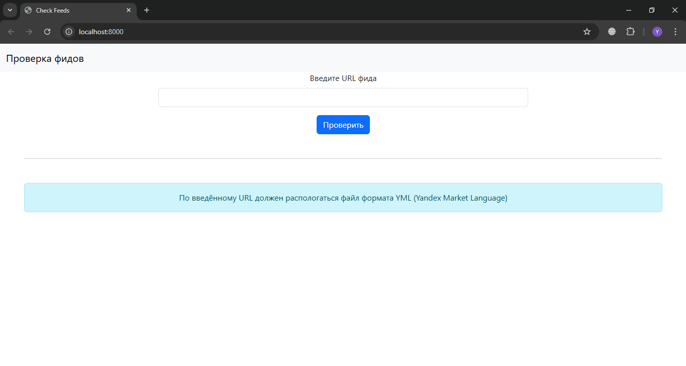
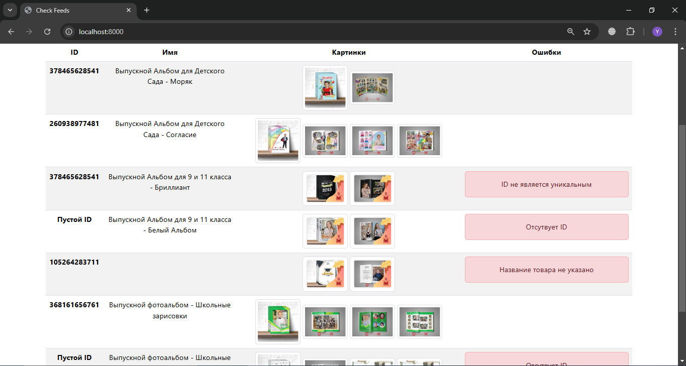
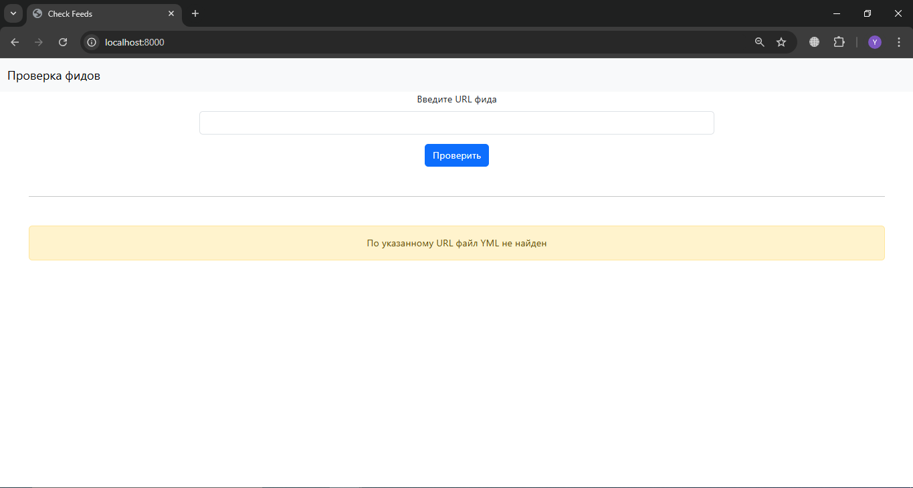
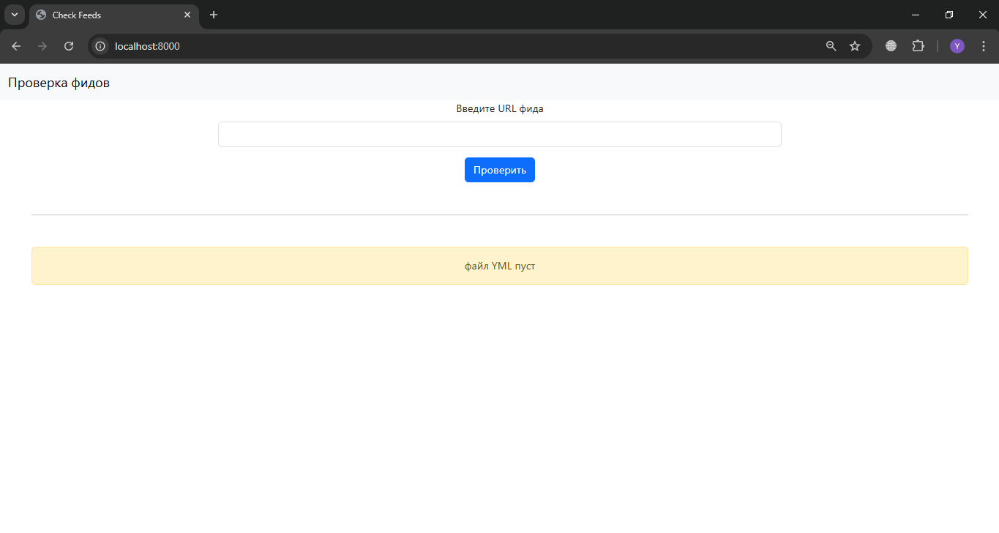
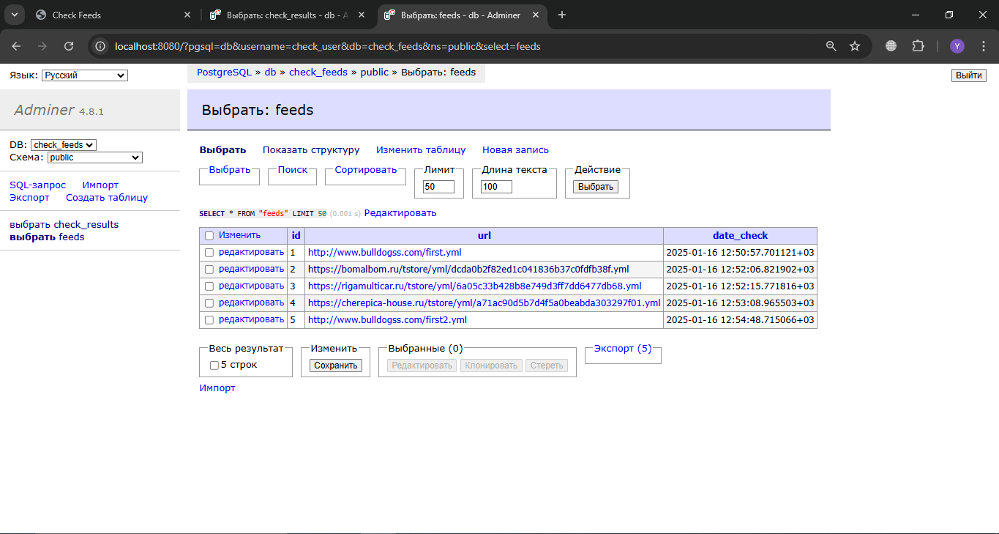
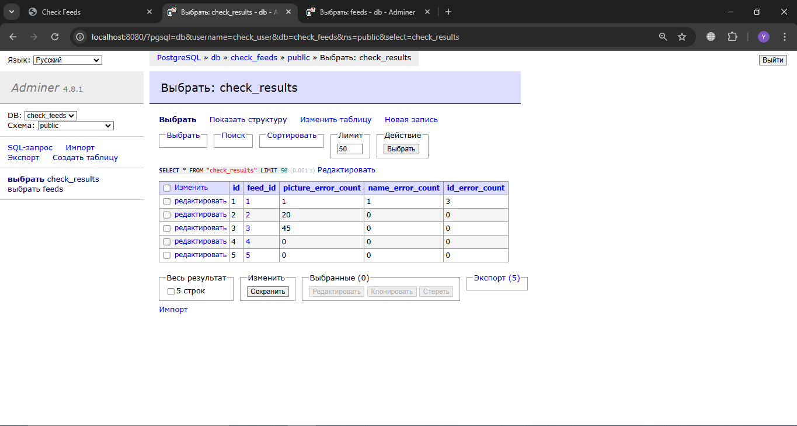

# Сервис проверки товарного фида

## О проекте

**Сервис проверки товарного фида** разработан для автоматизации работы директолога. 
Цель проекта — упростить, ускорить и повысить качество проверки товарных фидов в формате Yandex Market Language.

## Функциональность

Сервис предоставляет следующие возможности:

1. **Удобный просмотр всех изображений одновременно.**
2. **Проверка на наличие и уникальность ID объявлений.**
3. **Проверка наличия наименования у всех объявлений.**
4. **Проверка корректности количества изображений у всех объявлений:** от 1 до 5 изображений.
5. **Сохранение результатов проверки в базу данных.**

## Цель проекта

Разработка веб-сайта с функциями, которые помогают директологу эффективнее и быстрее решать поставленные задачи.

---

## Запуск проекта

1. Склонируйте репозиторий:
   ```bash
   git clone https://github.com/AleksandrMelexin/check-feeds.git
   ```
2. Создайте и активируйте виртуальное окружение:
   ```bash
   python -m venv .venv
   source .venv/bin/activate   # Для Linux/MacOS
   .venv\Scripts\activate    # Для Windows
   ```
3. Установите необходимые зависимости:
   ```bash
   pip install -r requirements.txt
   ```
4. Запустите приложение:
   ```bash
   python app.py
   ```
## Запуск проекта в docker

1. Перейти в папку deploy
   ```bash
   cd deploy
   ```
2. Выполнить команду:
   ```bash
   docker-compose up -d
   ```

## Технологии

Проект разработан с использованием следующих технологий:

- **Python** для серверной логики.
- **Flask** для разработки веб-приложения.
- **PostgreSQL** для работы с базой данных.
- **Шаблонизатор Jinja** для клиентской части.
- **Docker** для развёртывания проекта

## Демонстрация работы проекта

### Главная страница


### Обработка фидов


### Обработка ошибок



### Работа с базой данных



---
